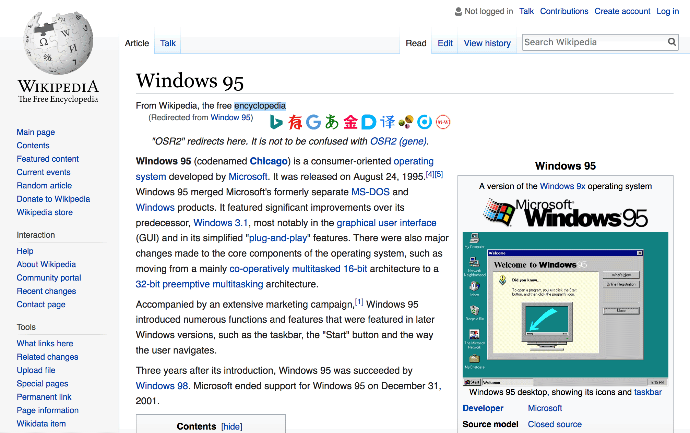
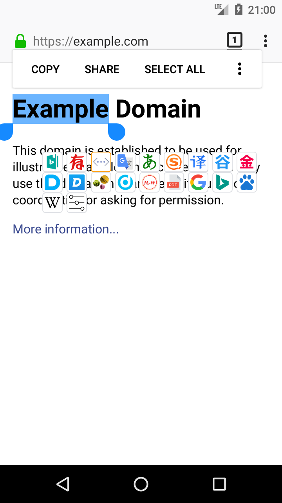
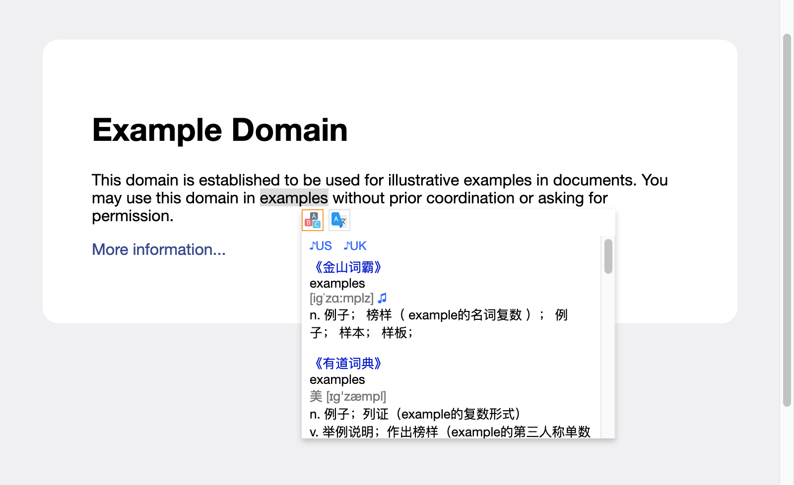
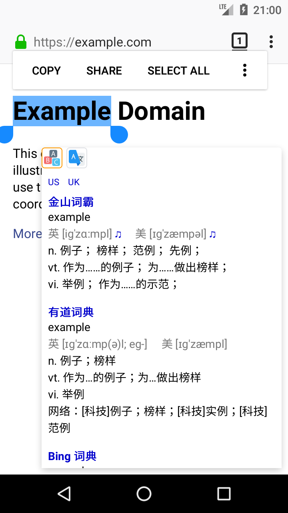

# Tampermonkey 油猴子脚本

## translate.js





特色：

* 划词翻译调用“金山词霸、有道词典（有道翻译）、Google Translate（谷歌翻译）、沪江小D、搜狗翻译、必应词典（必应翻译）、Microsoft Translator（必应在线翻译）、DeepL翻译、海词词典、百度翻译、Oxford Learner's Dictionaries、Oxford Dictionaries、Merriam-Webster、PDF 划词翻译、Google Search、Bing Search（必应搜索）、百度搜索、Wikipedia Search（维基百科搜索）”网页翻译
* 支持浏览器：Google Chrome、Firefox、Safari、Firefox for Android（无拖动）
* 支持顺序自定义
* 支持显示更多图标
* 支持图标拖动

### FAQ

For advanced users:

How do I add more sites?

Just add it to the JSON array `iconArray`.

```javascript
{
    name: 'Site name',
    id: 'Unique ID (combination of upper and lower case letters)',
    image: 'Convert image to Base64',
    host: ['example.com', 'dict.example.com', 'more.example.com'],
    popup(text) {
        popupCenter(`https://dict.example.com/search=${encodeURIComponent(text)}`, null, 800, screen.height);
    },
    custom(text) { /*JavaScript code that is executed after the above domains page is loaded.*/ }
}
```

Don't forget to change the version number (`@version`) to prevent automatic updates.

## translate-dictionary.js





特色：

* 划词翻译调用“有道词典（有道翻译）、金山词霸、Bing 词典（必应词典）、剑桥高阶、沪江小D、谷歌翻译”
* 支持浏览器：Google Chrome、Firefox、Safari（无发音）、Firefox for Android（无拖动）
* 支持发音
* 支持面板拖动
* 支持面板自动调整位置

## 同时安装

① 划词翻译：多词典查询

[https://greasyfork.org/zh-CN/scripts/376313-%E5%88%92%E8%AF%8D%E7%BF%BB%E8%AF%91-%E5%A4%9A%E8%AF%8D%E5%85%B8%E6%9F%A5%E8%AF%A2](https://greasyfork.org/zh-CN/scripts/376313-%E5%88%92%E8%AF%8D%E7%BF%BB%E8%AF%91-%E5%A4%9A%E8%AF%8D%E5%85%B8%E6%9F%A5%E8%AF%A2)

② Translate

[https://greasyfork.org/zh-CN/scripts/34921-translate](https://greasyfork.org/zh-CN/scripts/34921-translate)

可以使用更多的翻译引擎！

## 脚本下载地址

[https://greasyfork.org/zh-CN/users/158488-barrer](https://greasyfork.org/zh-CN/users/158488-barrer)

### 使用前

[https://tampermonkey.net/](https://tampermonkey.net/)

下载对应浏览器的扩展程序

Tampermonkey 是一款免费的浏览器扩展和最为流行的用户脚本管理器，它适用于 Chrome, Microsoft Edge, Safari, Opera Next, 和 Firefox。

虽然有些受支持的浏览器拥有原生的用户脚本支持，但 Tampermonkey 将在您的用户脚本管理方面提供更多的便利。 它提供了诸如便捷脚本安装、自动更新检查、标签中的脚本运行状况速览、内置的编辑器等众多功能， 同时Tampermonkey还有可能正常运行原本并不兼容的脚本。

它可以很快的安装好，来试一试吧！

脚本名 | 用途
-|-
translate.js|划词翻译调用“金山词霸、有道词典（有道翻译）、Google Translate（谷歌翻译）、沪江小D、搜狗翻译、必应词典（必应翻译）、Microsoft Translator（必应在线翻译）、DeepL翻译、海词词典、百度翻译、Oxford Learner's Dictionaries、Oxford Dictionaries、Merriam-Webster、PDF 划词翻译、Google Search、Bing Search（必应搜索）、百度搜索、Wikipedia Search（维基百科搜索）”网页翻译
translate-dictionary.js|划词翻译调用“有道词典（有道翻译）、金山词霸、Bing 词典（必应词典）、剑桥高阶、沪江小D、谷歌翻译”
